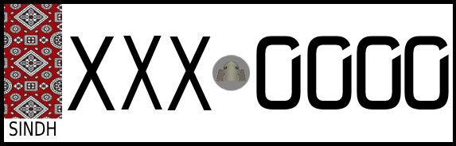
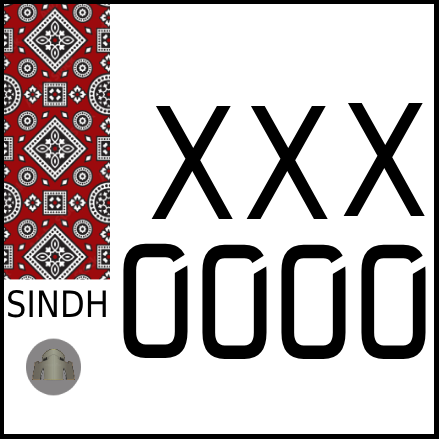

  

# Sindh Ajrak Style Number Plate – Free PSD 🎨

A high-resolution, fully editable **Ajrak-style vehicle number plate PSD**. This free design replicates the official format with accurate **plate size** and **letter dimensions** for bikes and cars.

---

# ⚠️ Disclaimer

This is not an official number plate, nor is it affiliated with or approved by any government authority. I do not hold a license to produce or sell number plates. This PSD design is shared purely for creative, educational, and personal use to assist fellow designers, developers, and enthusiasts in visualizing or customizing mock number plates. Please use responsibly and ensure compliance with local laws and regulations regarding vehicle registration and number plates.

---

## 🖼️ Previews

  
  
  

> PSDs for all the above are available in the repo. Feel free to download and modify them!

---

## 🛠️ Features

- ✅ Accurate plate sizes and font dimensions  
- ✅ Ajrak background with authentic design  
- ✅ Stencil-ready for "0" formatting  

---

## 📐 Official Plate Sizes & Digit Dimensions

### 🏍️ Bike Back
- **Plate Size**: 155 × 155 mm  
- **Digit Width**: 20.0 mm  
- **Digit Height**: 30.0 mm

### 🏍️ Bike Front
- **Plate Size**: 202 × 65 mm  
- **Digit Width**: 20.0 mm  
- **Digit Height**: 30.0 mm

### 🚗 Car (Front & Back)
- **Plate Size**: 305 × 155 mm  
- **Digit Width**: 26.0 mm  
- **Digit Height**: 46.0 mm

These dimensions have been incorporated into the design for precise visual consistency.

---

## ✏️ How to Customize the Number

1. **Open the `.psd` file** in Adobe Photoshop.
2. **Double-click the smart object layer** containing the number.
3. In the smart object:
   - Use the **Text Tool (T)** to change the number to your own.
   - If your number **includes a `0`**, **do not remove** the top-right stencil cross – it’s part of the official format.
   - Use **"Nova Square"** font if your number has `0`.  
   - For all other numbers, feel free to switch to a simple sans-serif font (like Arial or Helvetica) and **hide the stencil layer**.

> Save the smart object (Ctrl+S) to reflect changes in the main PSD.

---

## 🧠 Why This?

The official Ajrak number plates may be unavailable, or costly. This PSD gives you a **DIY creative alternative** with authentic dimensions and style.... Nah! I was just bored. 😅

---
